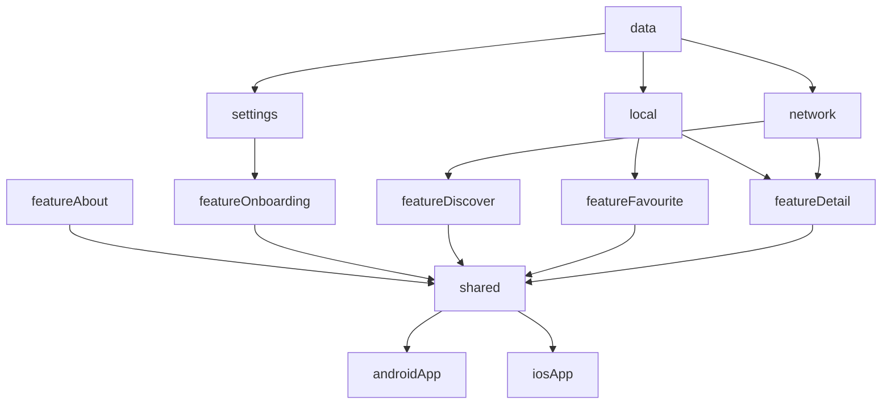
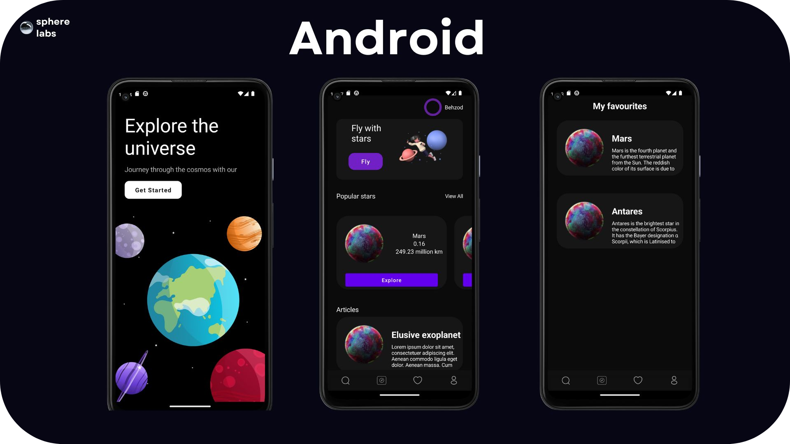
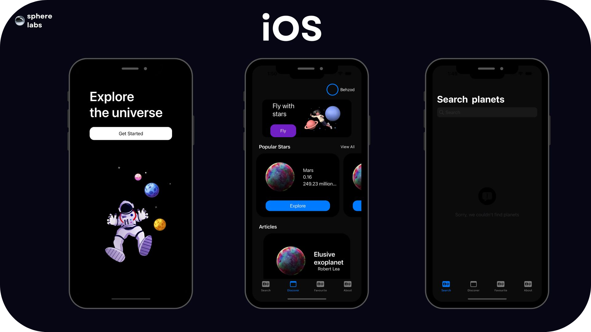

    

# Architecture
The app architecture has three layers: a data layer, a domain layer and a UI layer. Cosmo uses [Meteor KMP](https://github.com/getspherelabs/meteor-kmp) to create application using MVI architecture. It provides a unidirectional data flow (UDF), allowing you to handle state changes and propagate them to the UI efficiently.

# Technology

- [Kotlin]()
- [Kotlin Coroutine]()
- [Swift]()
- [Jetpack Compose]()
- [SwiftUI]()
- [Ktor]()
- [SqlDelight]()
- [Koin]()
- [Meteor]()
- [Multiplatform Settings]()
- [Moko KSwift]()
- [Combine]()
- [Coil]()
- [Meteor ViewModel]()
- [NavigationStack]()
- [Turbine]()
- [Ktlint]()
- [Spotless]()
- [Jacoco]()

# Modularization
Modularization is the practice of breaking the concept of a monolithic, one-module codebase into loosely coupled, self contained modules.

A barebone module is simply a directory with a Gradle build script inside. Usually though, a module will consist of one or more source sets and possibly a collection of resources or assets. Modules can be built and tested independently. Due to Gradle's flexibility there are few constraints as to how you can organize your project. In general, you should strive for low coupling and high cohesion.

- **Low coupling** - Modules should be as independent as possible from one another, so that changes to one module have zero or minimal impact on other modules. They should not possess knowledge of the inner workings of other modules.
- **High cohesion** - A module should comprise a collection of code that acts as a system. It should have clearly defined responsibilities and stay within boundaries of certain domain knowledge.

# Screenshots
| Android (Jetpack Compose)              | IOS     (SwiftUI)    |
| ---------------------- | ---------------------- |
|  |  |

  
# Testing

With a testable app architecture, the code follows a structure that allows you to easily test different parts of it in isolation. Testable architectures have other advantages, such as better readability, maintainability, scalability, and reusability.

Unit tests for the data layer, especially repositories. Most of the data layer should be platform-independent.

# Setup

You need to use at least Android Studio Flamingo (note: Java 17 is now the minimum version required). Requires XCode 13.2 or later (due to use of new Swift 5.5 concurrency APIs).
